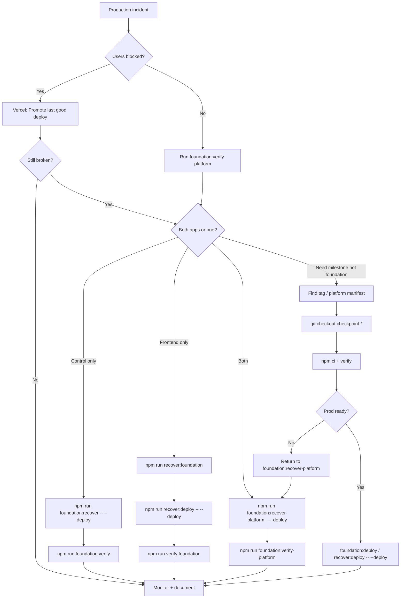

# SECTION 3B — Human Recovery Command Manual

**Purpose:** Operator can recover the 2MRRW platform during an emergency **without reading scripts or application code**.

**Repos:**

| Role | Default path | Sacred anchor |
|------|--------------|---------------|
| Control (backend) | `~/2MRRW-Control-System` | tag `foundation-stable-v1` → `6d988f5` |
| Frontend | `~/artist-platform` (or `ARTIST_PLATFORM_PATH`) | branch `frontend-stable-foundation` / tag `foundation-stable-v1` → `ce6ae20` |

**Platform scripts** (`foundation:recover-platform`, `foundation:checkpoint-platform`, `foundation:verify-platform`) run from the **control** repo and resolve the frontend via `ARTIST_PLATFORM_PATH`, sibling `../artist-platform`, or `/Users/recharge/artist-platform`.

---

## How to read each scenario

Every scenario below includes:

| Field | Meaning |
|-------|---------|
| **Commands / order** | Run top-to-bottom unless noted |
| **CWD** | Directory you must `cd` into first |
| **What it does** | Human-readable effect |
| **Files touched** | Working tree / generated artifacts |
| **Deploys?** | Whether production Vercel is updated |
| **Mutates git?** | Checkout, tags, branches |
| **Safe to repeat?** | Idempotency for panicked re-runs |
| **Verify** | How to know you succeeded |
| **Common failures** | Typical blockers |
| **Warnings** | Do-not-skip cautions |

---

## Scenario 1 — Recover latest backend foundation

**Goal:** Restore control system to sacred backend baseline.

| | |
|---|---|
| **Commands (order)** | 1. `cd ~/2MRRW-Control-System` → 2. `npm run foundation:recover` |
| **CWD** | `2MRRW-Control-System` |
| **What it does** | `git fetch --tags origin` → checkout `foundation-stable-v1` (`6d988f5`) → `npm ci` → `npm run verify` → `scripts/check-architecture-guardrails.sh` |
| **Files touched** | `node_modules/`, detached HEAD at tag; may warn on dirty tree |
| **Deploys?** | No (add `--deploy` for production) |
| **Mutates git?** | Yes — checkout tag |
| **Safe to repeat?** | Yes — re-runs fetch, ci, verify |
| **Verify** | `npm run foundation:verify` — health OK, **9** public releases |
| **Common failures** | Tag missing (`git fetch --tags origin`); dirty tree confusion; `npm ci` network |
| **Warnings** | Does not fix Vercel env or Supabase; deploy separately if prod is broken |

**With production deploy:**

```bash
cd ~/2MRRW-Control-System
npm run foundation:recover -- --deploy
```

---

## Scenario 2 — Recover latest frontend foundation

**Goal:** Restore artist-platform to sacred frontend baseline.

| | |
|---|---|
| **Commands (order)** | 1. `cd ~/artist-platform` → 2. `npm run recover:foundation` |
| **CWD** | `artist-platform` |
| **What it does** | Reads `docs/foundation/recovery-anchor.json` → checkout `frontend-stable-foundation` (`ce6ae20`) → `npm ci` → `verify:foundation` → `check:frontend-guardrails` → optional build |
| **Files touched** | `node_modules/`; git checkout branch/commit |
| **Deploys?** | No unless `--deploy` passed |
| **Mutates git?** | Yes — checkout ( `--force` is destructive) |
| **Safe to repeat?** | Yes (without `--force`) |
| **Verify** | `npm run verify:foundation` |
| **Common failures** | Missing anchor file; branch not fetched; env vars missing (warned, not fatal) |
| **Warnings** | `--force` discards local commits — use only when tree is corrupt |

**Dry-run first (recommended under stress):**

```bash
cd ~/artist-platform
npm run recover:foundation -- --dry-run
```

---

## Scenario 3 — Recover both systems together

**Goal:** Synchronized control + frontend foundation restore.

| | |
|---|---|
| **Commands (order)** | 1. `cd ~/2MRRW-Control-System` → 2. `npm run foundation:recover-platform` |
| **CWD** | Control repo (frontend invoked automatically) |
| **What it does** | `foundation:recover` then `recover:foundation` in resolved frontend path |
| **Files touched** | Both repos: `node_modules/`, git checkouts |
| **Deploys?** | No (unless `--deploy`) |
| **Mutates git?** | Yes — both repos |
| **Safe to repeat?** | Yes |
| **Verify** | `npm run foundation:verify-platform` |
| **Common failures** | `artist-platform not found` — set `export ARTIST_PLATFORM_PATH=~/artist-platform` |
| **Warnings** | Ensure sibling path or env var before incident |

**Recover + deploy both:**

```bash
cd ~/2MRRW-Control-System
npm run foundation:recover-platform -- --deploy
```

**Verify only (no checkout):**

```bash
npm run foundation:recover-platform -- --verify-only
```

---

## Scenario 4 — Recover latest checkpoint

**Goal:** Return control repo to most recent experimental milestone (not sacred foundation).

| | |
|---|---|
| **Commands (order)** | 1. `cd ~/2MRRW-Control-System` → 2. `git fetch --tags origin` → 3. `LATEST=$(git tag -l 'checkpoint-*' --sort=-creatordate | head -1)` → 4. `git checkout "$LATEST"` → 5. `npm ci` → 6. `npm run verify` → 7. `./scripts/check-architecture-guardrails.sh` |
| **CWD** | Control |
| **What it does** | Checkout newest `checkpoint-YYYYMMDD-HHMM` tag |
| **Files touched** | `node_modules/`; read manifest `2MRRW_RECOVERY_SYSTEM/FOUNDATION_SNAPSHOTS/checkpoint-*.md` |
| **Deploys?** | No — run `npm run foundation:deploy` after verify if needed |
| **Mutates git?** | Yes |
| **Safe to repeat?** | Yes |
| **Verify** | `npm run verify`; read snapshot note for expected commit |
| **Common failures** | No tags (`npm run foundation:checkpoint` first); wrong sort locale |
| **Warnings** | Checkpoints may be experimental — prefer Scenario 1 if prod is on fire |

---

## Scenario 5 — Recover specific historical checkpoint

**Goal:** Restore an exact dated backend milestone you already identified.

| | |
|---|---|
| **Commands (order)** | 1. `cd ~/2MRRW-Control-System` → 2. `git fetch --tags origin` → 3. `git checkout checkpoint-20260519-1430` *(replace with your tag)* → 4. `npm ci` → 5. `npm run verify` |
| **CWD** | Control |
| **What it does** | Pins tree to named checkpoint SHA |
| **Files touched** | `node_modules/`; consult `2MRRW_RECOVERY_SYSTEM/FOUNDATION_SNAPSHOTS/checkpoint-20260519-1430.md` |
| **Deploys?** | No |
| **Mutates git?** | Yes |
| **Safe to repeat?** | Yes |
| **Verify** | `git rev-parse HEAD` matches manifest; `npm run foundation:verify` after deploy |
| **Common failures** | Tag typo — format is `checkpoint-YYYYMMDD-HHMM` (no extra hyphens in date) |
| **Warnings** | Do not confuse with `foundation-stable-v1` |

---

## Scenario 6 — Recover specific frontend checkpoint

**Goal:** Restore artist-platform to a named frontend milestone.

| | |
|---|---|
| **Commands (order)** | 1. `cd ~/artist-platform` → 2. `git fetch --tags origin` → 3. `git checkout frontend-checkpoint-20260519-1430` → 4. `npm ci` → 5. `npm run verify:foundation` → 6. `npm run check:frontend-guardrails` |
| **CWD** | Frontend |
| **What it does** | Checkout annotated `frontend-checkpoint-*` tag |
| **Files touched** | `node_modules/`; manifest `docs/foundation/checkpoints/checkpoint-*.md` |
| **Deploys?** | No — `npm run recover:deploy -- --deploy` after verify |
| **Mutates git?** | Yes |
| **Safe to repeat?** | Yes |
| **Verify** | `npm run verify:foundation` |
| **Common failures** | Tag only local — `git push origin <tag>` may be needed on new machine |
| **Warnings** | Sacred baseline is `recover:foundation`, not arbitrary checkpoints |

---

## Scenario 7 — Recover specific backend checkpoint

Same as Scenario 5 when you already know the backend tag name. Use platform manifest (Scenario 8) if you only know the platform file name.

```bash
cd ~/2MRRW-Control-System
git fetch --tags origin
git checkout checkpoint-20260519-1030
npm ci
npm run verify
./scripts/check-architecture-guardrails.sh
```

---

## Scenario 8 — Recover latest platform checkpoint

**Goal:** Restore both repos using the newest coordinated platform manifest.

| | |
|---|---|
| **Commands (order)** | 1. `cd ~/2MRRW-Control-System` → 2. `ls -1t 2MRRW_RECOVERY_SYSTEM/FOUNDATION_SNAPSHOTS/platform-checkpoint-*.md | head -1` → 3. Open file; note `checkpoint-*` and `frontend-checkpoint-*` tags → 4. Backend: `git checkout <backend-tag>` → `npm ci` → `npm run verify` → 5. Frontend: `cd ~/artist-platform` → `git checkout <frontend-tag>` → `npm ci` → `npm run verify:foundation` |
| **CWD** | Control (read manifest); then each repo |
| **What it does** | Manual coordinated recall per manifest (no single npm script for arbitrary platform checkpoint) |
| **Files touched** | Both repos |
| **Deploys?** | No |
| **Mutates git?** | Yes |
| **Safe to repeat?** | Yes |
| **Verify** | `npm run foundation:verify-platform` |
| **Common failures** | Manifest/backend tag minute skew; tag not pushed to origin |
| **Warnings** | For sacred baseline use Scenario 3 instead |

**Alternative — return to sacred anchors (often safer):**

```bash
cd ~/2MRRW-Control-System
npm run foundation:recover-platform
```

---

## Scenario 9 — Recover a platform checkpoint plus redeploy

**Goal:** Restore coordinated milestone and push both apps to production.

| | |
|---|---|
| **Commands (order)** | **Option A (sacred foundation deploy):** 1. `cd ~/2MRRW-Control-System` → 2. `npm run foundation:recover-platform -- --deploy` **Option B (specific checkpoint):** 1. Scenario 8 checkout both tags → 2. `cd ~/2MRRW-Control-System` → `npm run foundation:deploy` → 3. `cd ~/artist-platform` → `npm run recover:deploy -- --deploy` |
| **CWD** | Control; then frontend for Option B step 3 |
| **What it does** | Option A: recover+verify+deploy chain per `run-platform-foundation-recovery.sh` |
| **Files touched** | Both repos + Vercel production |
| **Deploys?** | **Yes** |
| **Mutates git?** | Yes |
| **Safe to repeat?** | Deploy is repeatable; avoid double-deploy without verify between |
| **Verify** | `npm run foundation:verify-platform`; hit production URLs |
| **Common failures** | Vercel auth; build fail on checkpoint (not foundation-tested) |
| **Warnings** | Deploying experimental checkpoints to prod is high risk — prefer foundation recover |

---

## Scenario 10 — Roll back to previous stable foundation

**Goal:** Git-only return to sacred tags without full reinstall (first step) or full recover.

| | |
|---|---|
| **Commands (order)** | **Control:** `cd ~/2MRRW-Control-System` → `npm run foundation:rollback` → `npm ci` → `npm run verify` **Frontend:** `cd ~/artist-platform` → `npm run recover:rollback` (read Vercel steps) → optional `npm run recover:rollback -- --local` → `npm run recover:foundation` |
| **CWD** | Per repo |
| **What it does** | `foundation:rollback` = fetch tags + checkout `foundation-stable-v1` only; frontend rollback prints promote playbook |
| **Files touched** | Git HEAD only until `npm ci` |
| **Deploys?** | No from rollback scripts alone |
| **Mutates git?** | Yes (checkout) |
| **Safe to repeat?** | Yes |
| **Verify** | `npm run foundation:verify` / `npm run verify:foundation` |
| **Common failures** | Expecting rollback to deploy — it does not |
| **Warnings** | Fastest prod fix is often Vercel **Promote** previous deployment before git recover |

---

## Scenario 11 — Recover from offline desktop archive

**Goal:** Machine has zip/rsync backup but git remote is slow or unavailable.

| | |
|---|---|
| **Commands (order)** | 1. Unzip/rsync per [`LOCAL_DESKTOP_BACKUP_STRATEGY.md`](LOCAL_DESKTOP_BACKUP_STRATEGY.md) → 2. `cd ~/2MRRW-Control-System` → 3. `git fetch --tags origin` → 4. `git checkout foundation-stable-v1` → 5. `npm ci` → 6. `npm run foundation:verify` → 7. Repeat frontend with `frontend-stable-foundation` |
| **CWD** | Restored paths |
| **What it does** | Restores files from `~/Desktop/2MRRW-recovery-*.zip` or external drive |
| **Files touched** | Entire `2MRRW_RECOVERY_SYSTEM/` bundle; optional full repos |
| **Deploys?** | No |
| **Mutates git?** | After restore, yes on checkout |
| **Safe to repeat?** | Yes |
| **Verify** | `npm run foundation:verify-platform` when online |
| **Common failures** | Secrets not in zip — use password manager + `ENVIRONMENT_BACKUPS/*.example` |
| **Warnings** | Never store secret values in zip archives |

**Quick recovery bundle zip (create during calm):**

```bash
DATE=$(date +%Y%m%d)
cd ~/2MRRW-Control-System
zip -r ~/Desktop/2MRRW-recovery-$DATE.zip 2MRRW_RECOVERY_SYSTEM/
```

---

## Scenario 12 — Recover after catastrophic local corruption

**Goal:** `node_modules`, `.next`, or repo tree is unusable.

| | |
|---|---|
| **Commands (order)** | **Control:** 1. `cd ~/2MRRW-Control-System` → 2. `git fetch --tags origin` → 3. `git checkout foundation-stable-v1` → 4. `rm -rf node_modules .next` → 5. `npm ci` → 6. `npm run foundation:recover` **Frontend:** 1. `cd ~/artist-platform` → 2. `npm run recover:foundation -- --force` |
| **CWD** | Each repo |
| **What it does** | Hard reset to anchor; clean install |
| **Files touched** | Deletes `node_modules`, `.next`; git reset with `--force` on frontend |
| **Deploys?** | No |
| **Mutates git?** | Yes; `--force` may `git reset --hard` |
| **Safe to repeat?** | Yes |
| **Verify** | `npm run foundation:verify-platform` |
| **Common failures** | Uncommitted work lost with `--force` |
| **Warnings** | Commit or stash anything worth keeping before `--force` |

---

## Scenario 13 — Recover after accidental dependency mutation

**Goal:** `package.json` / lockfile drifted from foundation pins.

| | |
|---|---|
| **Commands (order)** | **Control:** 1. `npm run foundation:recover` (re-checkout tag restores pins) OR restore from `2MRRW_RECOVERY_SYSTEM/LOCKFILES/foundation-lock.json` + `DEPENDENCY_SNAPSHOTS/package.json` → 2. `npm ci` → 3. `npm run verify` **Frontend:** 1. `npm run recover:foundation` (restores lockfiles from anchor with default flags) |
| **CWD** | Each repo |
| **What it does** | Realigns dependencies to foundation era |
| **Files touched** | `package.json`, `package-lock.json`, `node_modules/` |
| **Deploys?** | No |
| **Mutates git?** | Checkout may restore committed pins; manual copy overwrites working tree |
| **Safe to repeat?** | Yes |
| **Verify** | `npm run verify` / `verify:foundation` |
| **Common failures** | `npm install` instead of `npm ci` reintroduces drift |
| **Warnings** | Do not `npm update` or bump `next` / `@supabase/supabase-js` to `latest` during recovery |

---

## Scenario 14 — Recover after broken deployment

**Goal:** Production deploy bad; need known-good code live.

| | |
|---|---|
| **Commands (order)** | 1. **Fastest:** Vercel dashboard → Promote previous deployment (see `recover:rollback` output) 2. **Code fix:** `cd ~/2MRRW-Control-System` → `npm run foundation:recover -- --deploy` 3. **Frontend:** `cd ~/artist-platform` → `npm run recover:foundation` → `npm run recover:deploy -- --deploy` |
| **CWD** | Control; frontend if site broken |
| **What it does** | Promote = instant; recover --deploy = rebuild + `vercel --prod --yes` |
| **Files touched** | Vercel deployment graph |
| **Deploys?** | **Yes** |
| **Mutates git?** | If using recover scripts, yes |
| **Safe to repeat?** | Promote yes; repeated deploys cost time |
| **Verify** | `npm run foundation:verify`; browser hard-refresh |
| **Common failures** | Build passes but runtime broken — promote old deploy first |
| **Warnings** | **Never** `git push --force` to `main` to fix a deploy |

---

## Scenario 15 — Recover exact milestone by timestamp

**Goal:** Find checkpoint created near a known date/time.

| | |
|---|---|
| **Commands (order)** | 1. `cd ~/2MRRW-Control-System` → 2. `git tag -l 'checkpoint-*' --sort=creatordate` → 3. `ls -1 2MRRW_RECOVERY_SYSTEM/FOUNDATION_SNAPSHOTS/checkpoint-*.md` → 4. `ls -1 2MRRW_RECOVERY_SYSTEM/FOUNDATION_SNAPSHOTS/platform-checkpoint-*.md` → 5. Frontend: `cd ~/artist-platform` → `git tag -l 'frontend-checkpoint-*'` → 6. Checkout matching `YYYYMMDD-HHMM` suffix → 7. `npm ci` + verify scripts |
| **CWD** | Control + frontend |
| **What it does** | Maps wall-clock to tag suffix `checkpoint-20260519-1430` |
| **Files touched** | Manifest markdown lists commit subjects |
| **Deploys?** | No |
| **Mutates git?** | Yes after checkout |
| **Safe to repeat?** | Yes |
| **Verify** | Manifest commit SHA == `git rev-parse HEAD` |
| **Common failures** | Platform manifest stamps may differ by one minute across repos |
| **Warnings** | Match **suffix** to manifest, not ISO date with extra hyphens |

---

## Scenario 16 — List all available checkpoints and foundations

**Goal:** Inventory before choosing a restore target.

| | |
|---|---|
| **Commands (order)** | **Control foundations:** `git tag -l 'foundation-stable*'` **Control checkpoints:** `git tag -l 'checkpoint-*' --sort=creatordate` **Platform manifests:** `ls -1 2MRRW_RECOVERY_SYSTEM/FOUNDATION_SNAPSHOTS/platform-checkpoint-*.md` **Frontend:** `cd ~/artist-platform` → `git tag -l 'foundation-stable*'` → `git tag -l 'frontend-checkpoint-*' --sort=creatordate` → `ls -1 docs/foundation/checkpoints/checkpoint-*.md` |
| **CWD** | Each repo |
| **What it does** | Read-only listing |
| **Files touched** | None |
| **Deploys?** | No |
| **Mutates git?** | No |
| **Safe to repeat?** | Yes |
| **Verify** | N/A — inspection only |
| **Common failures** | Tags not fetched — run `git fetch --tags origin` first |
| **Warnings** | Unpushed local tags won't appear on other machines |

---

## Scenario 17 — Verify restored milestone integrity

**Goal:** Confirm checkout matches expected baseline without changing it again.

| | |
|---|---|
| **Commands (order)** | 1. `cd ~/2MRRW-Control-System` → `npm run foundation:verify` 2. `cd ~/artist-platform` → `npm run verify:foundation` **Or platform:** `cd ~/2MRRW-Control-System` → `npm run foundation:verify-platform` |
| **CWD** | Control / frontend / control for platform |
| **What it does** | Layout rule, guardrails, tests, production curl (control) |
| **Files touched** | None (no checkout) |
| **Deploys?** | No |
| **Mutates git?** | No |
| **Safe to repeat?** | Yes — preferred post-recovery habit |
| **Verify** | All steps print `[OK]`; **9** releases on control |
| **Common failures** | Verifying while still on wrong branch; `CONTROL_URL` wrong |
| **Warnings** | `foundation:verify` does not fix drift — only reports |

**Override production URL:**

```bash
CONTROL_URL=https://2mrrw-control-system.vercel.app npm run foundation:verify
```

---

## Scenario 18 — Promote checkpoint into stable foundation

**Goal:** Rare, deliberate elevation of a verified milestone to a **new** sacred tag (never overwrite `foundation-stable-v1`).

| | |
|---|---|
| **Commands (order)** | **There is no automated promote script.** Manual discipline: 1. Verify checkpoint in staging: Scenario 17 2. Production smoke + sign-off 3. Create **new** versioned tag, e.g. `foundation-stable-v2` on verified SHA: `git tag -a foundation-stable-v2 -m "Promoted from checkpoint-…"` 4. Update docs in `KNOWN_GOOD_COMMITS/`, `recovery-anchor.json` (frontend), recovery bundle 5. `git push origin foundation-stable-v2` — **never** `git tag -f foundation-stable-v1` |
| **CWD** | Repo being promoted |
| **What it does** | Documents new anchor; does not auto-run on npm |
| **Files touched** | Git tags, recovery docs, anchor JSON |
| **Deploys?** | Only if you separately deploy |
| **Mutates git?** | Yes — new annotated tag only |
| **Safe to repeat?** | Tag creation fails if exists (good) |
| **Verify** | Team agrees; `foundation:verify` on new tag after updating `FOUNDATION_TAG` env in scripts |
| **Common failures** | Treating checkpoint as foundation without rename |
| **Warnings** | See [`FOUNDATION_TAG_DISCIPLINE.md`](FOUNDATION_TAG_DISCIPLINE.md) — **no auto-promotion** from `recover:checkpoint` |

---

## Scenario 19 — Restore frontend/backend synchronization after rollback

**Goal:** One side was rolled back; APIs or env URLs mismatched.

| | |
|---|---|
| **Commands (order)** | 1. `cd ~/2MRRW-Control-System` → `npm run foundation:recover-platform` 2. `npm run foundation:verify-platform` 3. Vercel env audit: control `ARTIST_PLATFORM_PUBLIC_URL`; frontend `NEXT_PUBLIC_CONTROL_SYSTEM_API_URL=https://2mrrw-control-system.vercel.app` 4. If only frontend deploy needed: `cd ~/artist-platform` → `npm run recover:deploy -- --deploy` |
| **CWD** | Control first |
| **What it does** | Aligns both repos to paired sacred anchors |
| **Files touched** | Both `node_modules/`; Vercel env (dashboard) |
| **Deploys?** | Optional step 4 |
| **Mutates git?** | Yes on recover-platform |
| **Safe to repeat?** | Yes |
| **Verify** | Public site loads releases; no CORS to wrong API host |
| **Common failures** | Frontend on checkpoint while control on foundation |
| **Warnings** | Fix env before chasing code bugs |

---

## Scenario 20 — Recover platform to last known production-safe state

**Goal:** Default disaster button — known-good dual foundation + verify (+ optional deploy).

| | |
|---|---|
| **Commands (order)** | 1. `cd ~/2MRRW-Control-System` → 2. `npm run foundation:recover-platform -- --deploy` *(omit `--deploy` for local-only)* 3. `npm run foundation:verify-platform` |
| **CWD** | Control |
| **What it does** | Backend `6d988f5` + frontend `ce6ae20` + full deploy chain when flagged |
| **Files touched** | Both repos; production Vercel |
| **Deploys?** | With `--deploy` |
| **Mutates git?** | Yes |
| **Safe to repeat?** | Yes; verify between deploy retries |
| **Verify** | Control: 9 releases; frontend: `verify:foundation` + live site |
| **Common failures** | Skipping verify-platform after partial failure |
| **Warnings** | If prod was healthy on Vercel, consider promote-before-redeploy (Scenario 14) |

**Dry-run plan:**

```bash
cd ~/2MRRW-Control-System
npm run foundation:recover-platform -- --dry-run
npm run foundation:recover-platform -- --deploy --dry-run
```

---

## Checkpoint vs foundation (recall discipline)

| | Checkpoints | Sacred foundations |
|---|-------------|-------------------|
| **Examples** | `checkpoint-20260519-1430`, `frontend-checkpoint-*`, `platform-checkpoint-*.md` | `foundation-stable-v1`, `frontend-stable-foundation` |
| **Purpose** | Frequent save points before risky work | Rare disaster baseline |
| **Overwrite** | Creation fails if tag exists | **Never** move or `-f` overwrite |
| **Default recovery** | Use only when you intend that milestone | **Scenario 1–3, 20** |
| **Identify safest** | Read manifest verify lines; prefer latest **foundation** for prod fire | Always production-smoked |

**Avoid accidental experimental restore:** Read tag prefix before `git checkout`. If unsure, run `npm run foundation:recover-platform` instead.

Detail: [`MILESTONE_RECOVERY_RECALL.md`](MILESTONE_RECOVERY_RECALL.md)

---

## Create checkpoints (before risky work)

| Scope | Command | CWD |
|-------|---------|-----|
| Backend only | `npm run foundation:checkpoint` | Control |
| Frontend only | `npm run recover:checkpoint` | Frontend |
| Platform (both + manifest) | `npm run foundation:checkpoint-platform` | Control |

Dry-run:

```bash
npm run foundation:checkpoint-platform -- --dry-run
cd ~/artist-platform && npm run recover:checkpoint -- --dry-run
```

---

## Offline recovery reference

| Asset | Location |
|-------|----------|
| Recovery bundle | `2MRRW_RECOVERY_SYSTEM/` |
| Lockfile archive | `2MRRW_RECOVERY_SYSTEM/LOCKFILES/foundation-lock.json` |
| Dependency snapshot | `2MRRW_RECOVERY_SYSTEM/DEPENDENCY_SNAPSHOTS/package.json` |
| Env name lists | `2MRRW_RECOVERY_SYSTEM/RECOVERY_GUIDES/ENVIRONMENT_VARIABLE_RECOVERY.md` |
| Env templates | `2MRRW_RECOVERY_SYSTEM/ENVIRONMENT_BACKUPS/` |
| Deploy IDs | `2MRRW_RECOVERY_SYSTEM/DEPLOYMENT_REFERENCES/` |
| Desktop backup how-to | [`LOCAL_DESKTOP_BACKUP_STRATEGY.md`](LOCAL_DESKTOP_BACKUP_STRATEGY.md) |

After total machine failure: restore zip → `git fetch --tags` → Scenario 20.

---

# 1. Quick command cheat sheet

| Situation | Command | CWD |
|-----------|---------|-----|
| Backend foundation | `npm run foundation:recover` | Control |
| Backend + deploy | `npm run foundation:recover -- --deploy` | Control |
| Backend verify only | `npm run foundation:verify` | Control |
| Backend deploy only | `npm run foundation:deploy` | Control |
| Backend git checkout only | `npm run foundation:rollback` | Control |
| Backend checkpoint | `npm run foundation:checkpoint` | Control |
| Frontend foundation | `npm run recover:foundation` | Frontend |
| Frontend verify | `npm run verify:foundation` | Frontend |
| Frontend deploy | `npm run recover:deploy -- --deploy` | Frontend |
| Frontend checkpoint | `npm run recover:checkpoint` | Frontend |
| Both foundations | `npm run foundation:recover-platform` | Control |
| Both + deploy | `npm run foundation:recover-platform -- --deploy` | Control |
| Both verify | `npm run foundation:verify-platform` | Control |
| Platform checkpoint | `npm run foundation:checkpoint-platform` | Control |
| Checkout backend CP | `git checkout checkpoint-YYYYMMDD-HHMM` | Control |
| Checkout frontend CP | `git checkout frontend-checkpoint-YYYYMMDD-HHMM` | Frontend |

**Anchors:** control `foundation-stable-v1` = `6d988f5` · frontend `frontend-stable-foundation` / tag `foundation-stable-v1` = `ce6ae20`

---

# 2. Emergency recovery flowchart



---

# 3. Safe checkpoint promotion rules

1. **Checkpoints are disposable milestones** — create before risky work; never delete tags casually.
2. **Foundations are sacred** — `foundation-stable-v1` (both repos' lineage) is not overwritten; new baselines get **new versioned names** (`foundation-stable-v2`).
3. **No automatic promotion** — `recover:checkpoint` and `foundation:checkpoint` do not elevate to foundation.
4. **Fail-if-exists** — checkpoint scripts refuse duplicate tag names; do not `-f` to bypass.
5. **Manifests are append-only** — `FOUNDATION_SNAPSHOTS/`, `docs/foundation/checkpoints/`.
6. **Push tags** after checkpoint when team needs them: `git push origin <tag>`.
7. **Promotion checklist:** verify locally → verify production smoke → new annotated tag → update `recovery-anchor.json` / KNOWN_GOOD docs → announce → optional deploy.

---

# 4. Disaster recovery priority order

1. **Protect users** — Vercel promote previous deployment (fastest).
2. **Assess scope** — control only, frontend only, or both (`foundation:verify-platform`).
3. **Restore sacred foundations** — `npm run foundation:recover-platform` (add `--deploy` when prod must match).
4. **Verify** — `npm run foundation:verify-platform` (9 control releases, frontend guardrails).
5. **If foundation insufficient** — identify checkpoint/manifest (Scenario 15–16); checkout; verify before deploy.
6. **Fix env/secrets** — `ENVIRONMENT_VARIABLE_RECOVERY.md`; never commit secrets.
7. **Document** — note incident, tag used, deploy IDs; create `foundation:checkpoint` before next change.
8. **Offline** — desktop zip of `2MRRW_RECOVERY_SYSTEM/` if GitHub unavailable.

---

# 5. Do not do this (recovery mistakes)

| Mistake | Why it hurts |
|---------|----------------|
| `git push --force` to `main` or `frontend-stable-foundation` | Destroys team history; violates recovery protocol |
| `git tag -f foundation-stable-v1` | Corrupts sacred anchor lineage |
| Add `buildControlCatalogPayload` to `src/app/layout.tsx` | Causes hydration / 504 class failures |
| `npm install` / bump deps to `latest` during firefight | Breaks reproducible foundation |
| Deploy from random branch without verify | Spreads broken build |
| Delete old `checkpoint-*` tags | Removes rollback ladder |
| Run `recover:deploy -- --deploy` without `verify:foundation` | Ships unverified tree |
| Store secrets in recovery zip | Leak risk |
| Assume checkpoint = production-safe | Checkpoints are experimental until promoted |
| Skip `git fetch --tags origin` | Checkout fails on fresh clone |
| Improvise when `foundation:recover` exists | Scattered curls miss guardrails |

---

## Related guides

- [`ONE_COMMAND_RECOVERY.md`](ONE_COMMAND_RECOVERY.md) — control 10-step flow
- [`PLATFORM_ONE_COMMAND_RECOVERY.md`](PLATFORM_ONE_COMMAND_RECOVERY.md) — Command 3
- [`MILESTONE_RECOVERY_RECALL.md`](MILESTONE_RECOVERY_RECALL.md) — checkpoint recall
- [`EMERGENCY_RECOVERY_PLAYBOOK.md`](EMERGENCY_RECOVERY_PLAYBOOK.md) — symptom-based (504, hydration, etc.)
- [`LOCAL_DESKTOP_BACKUP_STRATEGY.md`](LOCAL_DESKTOP_BACKUP_STRATEGY.md) — offline copies
- [`FOUNDATION_TAG_DISCIPLINE.md`](FOUNDATION_TAG_DISCIPLINE.md) — sacred vs milestone
- Frontend: `artist-platform/docs/foundation/FRONTEND_RECOVERY_COMMAND_REPORT.md`

*Last updated: 2026-05-19 — operational lock-in era.*
