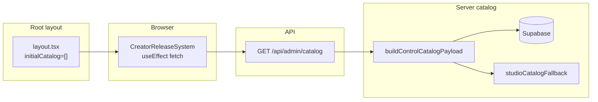

# Current System State

Architecture snapshot at foundation lock-in (`0e1b15a` / `c9b4465` era).

## Request flow (catalog / studio)



## Layout: empty catalog

`src/app/layout.tsx` renders:

```tsx
<OperationalShell initialCatalog={[]}>{children}</OperationalShell>
```

- **No** `buildControlCatalogPayload()` in layout.
- **No** `export const dynamic = "force-dynamic"` on root layout.
- First paint does not block on full catalog + signed URLs.

## Client fetch

`CreatorReleaseSystem` (`src/components/control/CreatorReleaseSystem.tsx`):

- Starts with `initialCatalog` (empty from layout).
- On studio routes, `controlCatalogClient.fetchControlCatalog()` → `GET /api/admin/catalog` with `cache: "no-store"`.
- Sets `catalogLoading` until response arrives.

## Server catalog + fallback

`buildControlCatalogPayload` (`src/server/catalog/controlCatalogPayload.ts`):

- Loads releases from Supabase via `releaseCatalogService` (scoped `media_assets` queries).
- Uses public URL resolution + `slugMotionPublicUrl` (no N× signed URL storm).
- On timeout / empty DB: **`studioCatalogFallback`** supplies in-memory studio catalog within SLA.

Admin route only: `src/app/api/admin/catalog/route.ts`.

## MP4 / JPEG rules

Resolver: `buildReleasePrimaryAsset` (`src/lib/media/releasePrimaryAsset.ts`).

| Release kind | Primary display | Rule |
|--------------|-----------------|------|
| **Single** (animated) | `mp4` | Motion URL / `slugMotionPublicUrl` wins over static JPEG |
| **Album** | `jpg` | Static cover; no slug MP4 unless explicit loop on release |
| **Feature** | `jpg` | Static artwork |
| **Stale JPEG primary** | Upgraded to `mp4` | `resolveDisplayPrimaryAsset` when `loopUrl` / motion exists |

Slug motion map: `src/lib/media/frontendMediaFallbacks.ts` → `slugMotionPublicUrl`.

Public API applies same rules: `src/app/api/public/releases/route.ts`.

## Hydration / ingestion

- `ensureFrontendReleaseEcosystemImported()` runs on **`/dashboard` only** (not every page).
- Promise cache in `frontendReleaseIngestionService.ts` dedupes concurrent imports.

## Health & diagnostics

| Route | Role |
|-------|------|
| `/api/health/basic` | Fast liveness (`ok`, `timestamp`) |
| `/api/health/db` | Supabase connectivity (bounded timeout) |
| `/diagnostics` | Ops UI (`force-dynamic` allowed here, not root layout) |

## Singleton Supabase

`src/server/supabase/client.ts` — single server client, `fetchWithTimeout`, service-role key validation.

## Guardrails

Run `./scripts/check-architecture-guardrails.sh` before merge to `main`. See `docs/ARCHITECTURE_GUARDRAILS.md`.
